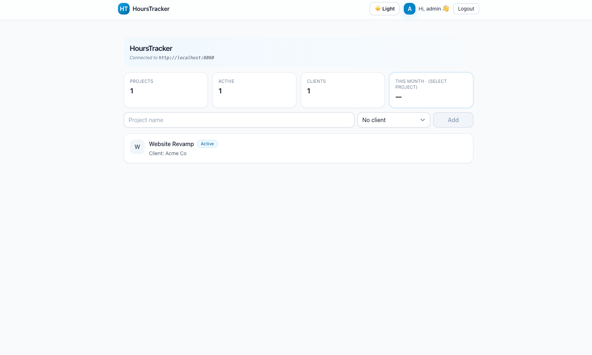
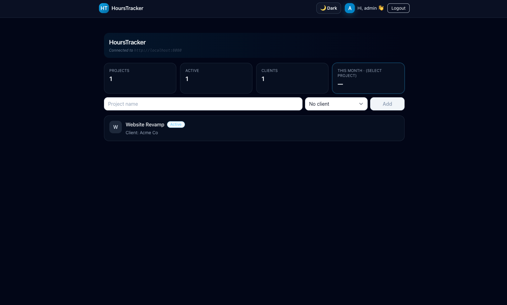

# ⏱️ HoursTracker

A clean and minimal time-tracking app built with **React + Tailwind CSS** (frontend) and a **Spring Boot** backend.  
You can create projects, assign clients, and log billable hours — all within a calm, branded interface that supports dark mode and authentication.

---

## ✨ Features

- Create and manage projects & clients
- Log billable / non-billable time entries
- Filter entries by week or month
- Dashboard summary cards (projects, clients, hours)
- Toast notifications for add/delete feedback
- Light & dark theme toggle
- Demo login system (`admin / 1234`) with “remember me”
- Clean responsive UI styled with Tailwind

---

## 🔗 Demo

*(Links will be added after deployment)*
- **Frontend (Vercel)** → coming soon
- **Backend (Render)** → coming soon

---

## 🔐 Demo Credentials
username: admin
password: 1234

Use the "Remember me" option to stay logged in between refreshes.

---

## 🛠️ Tech Stack

**Frontend**
- React (Vite)
- Tailwind CSS
- Context-based Auth system
- Deployed on Vercel *(soon)*

**Backend**
- Java Spring Boot REST API
- Spring Data JPA + PostgreSQL
- Integration & Unit tests
- Deployed on Render *(soon)*

---

## 🚀 Setup (Frontend)
````markdown
```bash
cd frontend
npm install
npm run dev
```` 

App runs on http://localhost:5174

To configure your backend connection, copy .env.example → .env and edit:
VITE_API_URL=http://localhost:8080

## 🚀 Setup (Backend)
````markdown
```bash
cd backend
./mvnw spring-boot:run
```` 


## 🖼️ Screenshots

Light mode preview  


Dark mode preview  



📁 Folder Structure
hourstracker/
│
├── backend/           → Spring Boot REST API
├── frontend/          → React + Tailwind app
│   ├── src/
│   │   ├── components/
│   │   ├── auth/
│   │   └── utils/
│   ├── public/
│   └── README.md


🧩 Future improvements

Real JWT login linked to backend

Timesheet export (CSV / PDF)

Role-based views (admin vs user)
